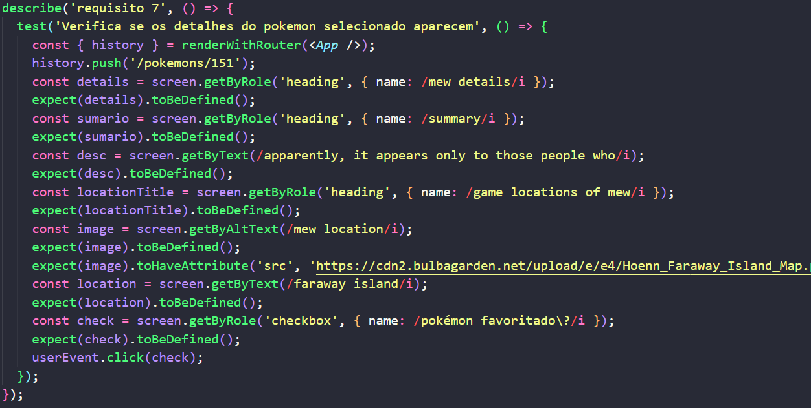

<h1>Projeto de testes em react</hi>
 
 

<h2>Oque foi desenvolvido:</h2>
<ul>
  <li>Utilizar os seletores (queries) da React-Testing-Library em testes automatizados.</li>
  <li>Simular eventos com a React-Testing-Library em testes automatizados.</li>
  <li>Testar fluxos lógicos assíncronos com a React-Testing-Library.</li>
  <li>Escrever testes que permitam a refatoração da estrutura dos componentes da aplicação sem necessidade de serem alterados.</li>
  <li>Criar mocks de APIs utilizando fetch.</li>
  <li>Testar inputs.</li>
</ul>

Projeto desenvolvido em: 30/03/2022
